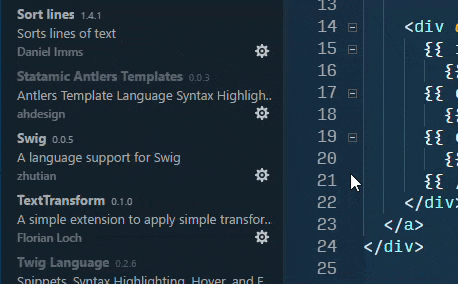

"Antlers" Statamic syntax highlighting for Visual Studio Code
=============================================================

This started as a weekend project to bring Statamic tag syntax highlighting to Sublime Text. I pulled a lot of the information for this from this ExpressionEngine bundle: https://github.com/fcgrx/ExpressionEngine2-Sublime-Text-3-Bundle and looking at this documentation: http://docs.sublimetext.info/en/latest/extensibility/syntaxdefs.html. ~~In all honesty, I still don't understand why much of the syntax works. I was able to port the Sublime Text version over to Atom.~~ I have a much better understanding of how grammars work now, so future versions should work much better.

I called this Antlers because it was just fun... I mean, heck... everything about Statamic is fun.

What is Statamic?
-----------------

Statamic (http://statamic.com) is a no-database, flat-file content management system that is far more capable than you would ever expect it to be. It's crazy fun to develop with as well.

How to use
----------

This extension now essentially replaces the HTML syntax so that Antlers will take advantage of HTML intellisense and Emmet, so I recommend only enabling it for Statamic projects. You can do this via the "Enable (Workspace)" option.



Note that you won't have to select Antlers as your language -- if enabled, it will automatically kick in for any .html, .htm, or .xhtml file.

If you use a beautifier in VSC
------------------------------

Update your VSC settings, p.e.:

```
"beautify.language": {
    "html": [
      "htm",
      "html",
      "antlers"
    ]
  }
```
